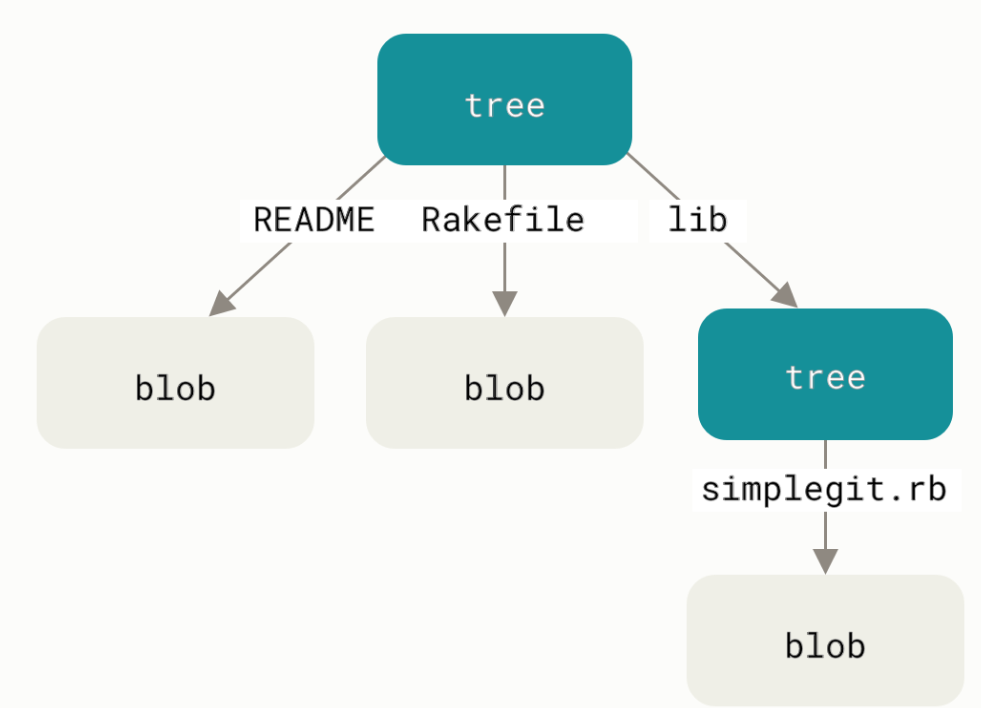

# [`git init`](https://git-scm.com/docs/git-init)
`git init` initializes a Git repository by creating a `.git` directory with some files & directories inside it.

# [The `.git` directory](https://blog.meain.io/2023/what-is-in-dot-git/)
```
.git
├── config
├── HEAD
├── hooks
│   └── prepare-commit-msg.msample
├── objects
│   ├── info
│   └── pack
└── refs
    ├── heads
    └── tags
```

 - `config` is a text file that contains your git configuration for the current repo. If you look into it, you would see some basic settings for you repo like the author, filemode etc.
 - `HEAD` contains the current head of the repo. Depending on what you have set your "default" branch to be, it will be `refs/heads/master` or `refs/heads/main` or whatever else you had set to. As you might have guessed, this is pointing to `refs/heads` folder that you can see below, and into a file called `master` which does not exist as of now. This file `master` will only show up after you make your first commit.
 - `hooks` contain any scripts that can be run before/after git does anything. I have written another blog here which goes a bit more into how git hooks work.
 - objects contains the git objects, ie the data about the files, commits etc in your repo. We will go in depth into this in this blog.
 - `refs` as we previously mentioned, stores references(pointers). `refs/heads` contains pointers to branches and `refs/tags` contains pointers to tags. We will go into what these files look like soon.

# [Git object storage](https://git-scm.com/book/en/v2/Git-Internals-Git-Objects)
Git first constructs a header which starts by identifying the type of object — in this case, a blob. To that first part of the header, Git adds a space followed by the size in bytes of the content, and adding a final null byte:
```python
content = "hello world"
header = f"blob {len(content)}\0"
```
Git concatenates the header and the original content and then calculates the SHA-1 checksum of that new content. You can calculate the SHA-1 value of a string in python using the hashlib library.
```python
from hashlib import sha1

store = header + content
hash = sha1(store).hexdigest()
# 95d09f2b10159347eece71399a7e2e907ea3df4f
```

Git compresses the new content with zlib. Finally, you’ll write your zlib-deflated content to an object on disk. You’ll determine the path of the object you want to write out (the first two characters of the SHA-1 value being the subdirectory name, and the last 38 characters being the filename within that directory)

```python
import zlib

dir = f".git/objects/{hash[:2]}"
path = f"{dir}/{hash[2:]}"
 # .git/objects/95/d09f2b10159347eece71399a7e2e907ea3df4f

os.makedirs(dir, exist_ok=True)
with open(path, "wb") as f:
   f.write(zlib.compress(store))
```


# [`git cat-file`](https://git-scm.com/docs/git-cat-file)


Git also has a plumbing command to view the content of an object. You can use `git cat-file` with `-t` for type, `-s` for size and `-p` for content.

Syntax - `git cat-file <type> <object>`

```bash
$ git cat-file -p 95d09f2b10159347eece71399a7e2e907ea3df4f
hello world
```

# [`git hash-object`](https://git-scm.com/docs/git-hash-object)
`git hash-object` is used to compute the SHA hash of a Git object. When used with the `-w` flag, it also writes the object to the `.git/objects` directory.

Syntax - `git hash-object [-t <type>] [-w] [--path=<file>`

```bash
$ git hash-object -w test.txt
95d09f2b10159347eece71399a7e2e907ea3df4f
```

# [Tree objects](https://git-scm.com/book/en/v2/Git-Internals-Git-Objects#_tree_objects)
Trees are used to store directory structures.  
A tree object has multiple "entries". Each entry includes:
 - A SHA hash that points to a blob or tree object
     - If the entry is a file, this points to a blob object
     - If the entry is a directory, this points to a tree object
 - The name of the file/directory
 - The mode of the file/directory

This is a simplified version of the permissions you'd see in a Unix file system.  
 - For files, the valid values are:
   - `100644` (regular file)
   - `100755` (executable file)
   - `120000` (symbolic link)
 - For directories, the value is `40000`

For example, let’s say you have a project where the most-recent tree looks something like:

```bash
$ git cat-file -p master^{tree}
100644 blob a906cb2a4a904a152e80877d4088654daad0c859      README
100644 blob 8f94139338f9404f26296befa88755fc2598c289      Rakefile
040000 tree 99f1a6d12cb4b6f19c8655fca46c3ecf317074e0      lib
```

The master^{tree} syntax specifies the tree object that is pointed to by the last commit on your master branch. Notice that the lib subdirectory isn’t a blob but a pointer to another tree:
```bash
$ git cat-file -p 99f1a6d12cb4b6f19c8655fca46c3ecf317074e0
100644 blob 47c6340d6459e05787f644c2447d2595f5d3a54b      simplegit.rb
```
Conceptually, the data that Git is storing looks something like this:


###### Note
In CMD on Windows, the ^ character is used for escaping, so you have to double it to avoid this: git cat-file -p master^^{tree}. When using PowerShell, parameters using {} characters have to be quoted to avoid the parameter being parsed incorrectly: git cat-file -p 'master^{tree}'.

# Tree object storage
The file starts with `tree <size>\0`. This is the "object header", similar to what we saw with blob objects.

After the header, there are multiple entries. Each entry is of the form `<mode> <name>\0<sha>`.

 - `<mode>` is the mode of the file/directory (check the previous section for valid values)
 - `<name>` is the name of the file/directory
 - `\0` is a null byte
 - `<20_byte_sha>` is the 20-byte SHA-1 hash of the blob/tree

In a tree object file, entries are sorted by their name. The output of ls-tree matches this order.


# [`git ls-tree`](https://git-scm.com/docs/git-ls-tree)
The `git ls-tree` command is used to inspect a tree object.
 
```
usage: git ls-tree [<options>] <tree-ish> [<path>...]

    -d                    only show trees
    -r                    recurse into subtrees
    -t                    show trees when recursing
    -z                    terminate entries with NUL byte
    -l, --long            include object size
    --name-only           list only filenames
    --name-status         list only filenames
    --object-only         list only objects
    --full-name           use full path names
    --full-tree           list entire tree; not just current directory (implies --full-name)
    --format <format>     format to use for the output
    --abbrev[=<n>]        use <n> digits to display object names
```
# [`git write-tree`](https://git-scm.com/docs/git-write-tree)
The `git write-tree` command creates a tree object from the current state of the "staging area". The staging area is a place where changes go when you run `git add`.

 - Iterate over the files/directories in the working directory
 - If the entry is a file, create a blob object and record its SHA hash
 - If the entry is a directory, recursively create a tree object and record its SHA hash
 - Once you have all the entries and their SHA hashes, write the tree object to the `.git/objects` directory

# [Commit objects](https://git-scm.com/book/en/v2/Git-Internals-Git-Objects#_git_commit_objects)
The format for a commit object is simple: 
 - it specifies the top-level tree for the snapshot of the project at that point
 - the parent commits if any (the commit object described above does not have any parents)
 - the author/committer information (which uses your user.name and user.email configuration settings and a timestamp)
 - a blank line
 - and then the commit message.

```bash
$ git cat-file -p fdf4fc3
tree d8329fc1cc938780ffdd9f94e0d364e0ea74f579
author Scott Chacon <schacon@gmail.com> 1243040974 -0700
committer Scott Chacon <schacon@gmail.com> 1243040974 -0700

First commit
```

# [`git commit-tree`](https://git-scm.com/docs/git-commit-tree)
The `git commit-tree` command creates a commit object.

# Git Protocol

### Refs file
The first step on the git protocol is to stablish the tell the server side tha will want to know the state of git at their end, we do this by making a get request to the server.
We can achieve this by request the reference to the following url: /info/refs?service=git-upload-pack.

Example - `0000015547b37f1a82bfe85f6d8df52b6258b75e4343b7fd HEADmulti_ack thin-pack side-band side-band-64k ofs-delta shallow deepen-since deepen-not deepen-relative no-progress include-tag multi_ack_detailed allow-tip-sha1-in-want allow-reachable-sha1-in-want no-done symref=HEAD:refs/heads/master filter object-format=sha1 agent=git/github-8e2ff7c5586f`


# Docs
https://blog.meain.io/2023/what-is-in-dot-git/  
https://blog.meain.io/2019/making-sure-you-wont-commit-conflict-markers/  
[Inside the hidden Git folder](https://www.youtube.com/watch?v=bSA91XTzeuA)  
[Git Fundamentals](https://www.youtube.com/watch?v=BIjrKuJGTxw&t=36s)  
[Write yourself a git](https://wyag.thb.lt/)  
https://stackoverflow.com/questions/14790681/what-is-the-internal-format-of-a-git-tree-object    
https://stackoverflow.com/questions/3178566/how-to-deflate-with-a-command-line-tool-to-extract-a-git-object  
https://benhoyt.com/writings/pygit/#committing  

# Clone Docs (need to go through again, check protocolv2)
1. https://stackoverflow.com/questions/68062812/what-does-the-git-smart-https-protocol-fully-look-like-in-all-its-glory
2. https://forum.codecrafters.io/t/step-for-git-clone-implementing-the-git-protocol/4407
3. https://git-scm.com/docs/http-protocol
4. https://git-scm.com/docs/git-upload-pack
5. https://git-scm.com/docs/gitprotocol-pack
6. https://git-scm.com/docs/gitformat-pack
7. https://codewords.recurse.com/issues/three/unpacking-git-packfiles
8. https://medium.com/@concertdaw/sneaky-git-number-encoding-ddcc5db5329f
9. https://forum.codecrafters.io/t/python-mg6-clone-command-stuck-on-tree-checkout/4747/11
10. https://i27ae15.github.io/git-protocol-doc/
11. https://github.com/eaverdeja/codecrafters-git-python/tree/master
12. https://github.com/benhoyt/pygit
13. https://chatgpt.com/c/67d46cb8-fc1c-8002-b6ad-af6572b851d9
